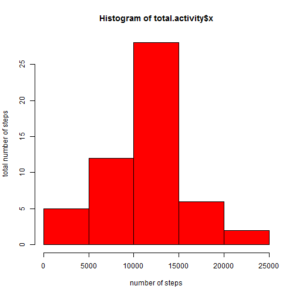
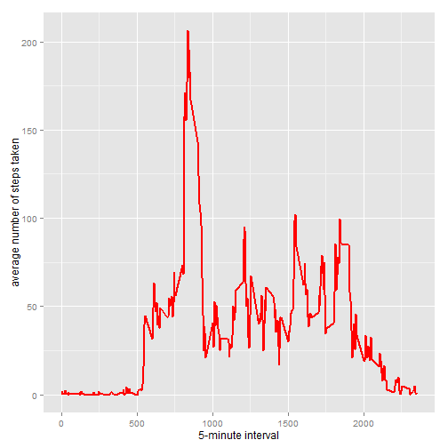
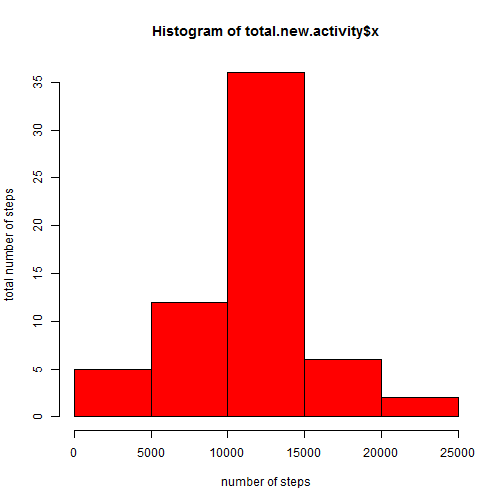
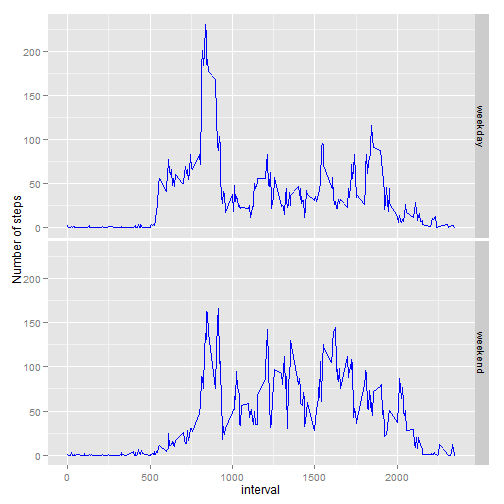

=====================================================================================================================


### Loading and preprocessing the data


```r
activity <- read.csv("activity.csv", header = TRUE)
activity <- transform(activity, date=as.character(date))
activity_rm_na <- na.omit(activity)
```


### What is mean total number of steps taken per day?

1.Make a histogram of the total number of steps taken each day


```r
total.activity <- aggregate(activity_rm_na$steps, list(activity_rm_na$date), sum)
hist(total.activity$x, col="red", xlab="number of steps", ylab="total number of steps")
```

 

2.Calculate and report the **mean** and **median** total number of steps taken per day


```r
Mean <- mean(activity_rm_na$steps)
Median <- median(activity_rm_na$steps)
```

the mean total number of steps taken per day is **37.3826**, and the median total number of steps taken per day is **0**.


### What is the average daily activity pattern?

1.Make a time series plot of the interval and the average number of steps taken


```r
mean.activity <- aggregate(activity_rm_na$steps, list(activity_rm_na$interval), mean)
colnames(mean.activity) <- c("interval", "mean_steps")
library(ggplot2)
```

```
## Find out what's changed in ggplot2 with
## news(Version == "1.0.0", package = "ggplot2")
```

```r
ggplot(mean.activity, aes(interval, mean_steps)) + geom_line(col="red", lwd=1) + xlab("5-minute interval") + ylab("average number of steps taken")
```

 

2.The interval contains the maximum number of steps


```r
Interval <- mean.activity[which.max(mean.activity$mean_steps),1];Interval
```

```
## [1] 835
```

The interval which contains the maximum number of steps is **835**.


### Imputing missing values

1.Calculate and report the total number of missing values in the dataset


```r
na_nrow <- nrow(activity) - nrow(activity_rm_na);na_nrow
```

```
## [1] 2304
```

The total number of missing values in the dataset is **2304**

3.Create a new dataset called **new.activity** that is equal to the original dataset but with the missing data filled in.


```r
new.activity <- activity
for(i in 1 : nrow(new.activity)){
    if(is.na(new.activity[i,1])){
        new.activity[i,1] <- mean.activity[which(mean.activity$interval==new.activity[i,"interval"]),2]
    }
}
```

4.histogram of the total number of steps taken each day


```r
total.new.activity <- aggregate(new.activity$steps, list(new.activity$date), sum)
hist(total.new.activity$x, col="red", xlab="number of steps", ylab="total number of steps")
```

 

The mean total number of steps taken per day in the new dataset is **37.3826**.

The median total number of steps taken per day in the new dataset is **0**.


### Are there differences in activity patterns between weekdays and weekends?

1.Create a new factor variable in the dataset with two levels "weekday"� and "weekend"� indicating whether a given date is a weekday or weekend day.


```r
new.activity <- transform(new.activity, date = as.Date(date))
new.activity$weekdays <- weekdays(new.activity$date)
new.activity$week <- character(nrow(new.activity))
for(i in 1: length(new.activity$weekdays)){
    if(new.activity$weekdays[i] %in% c("Saturday","Sunday")) {
        new.activity$week[i] <- "weekend"
    } else {
        new.activity$week[i] <- "weekday"
    }
}
new.activity$week <- as.factor(new.activity$week)
```

2.Make a panel plot containing a time series plot of the 5-minute interval and the average number of steps taken


```r
library(plyr)
options(digits=4)
plotdata <- ddply(new.activity, .(interval, week), function(x) {mean(x$steps)})
ggplot(plotdata, aes(interval, V1)) + geom_line(col="blue", lwd=0.5) + 
    xlab("interval") + ylab("Number of steps") + facet_grid(week~.)
```

 
